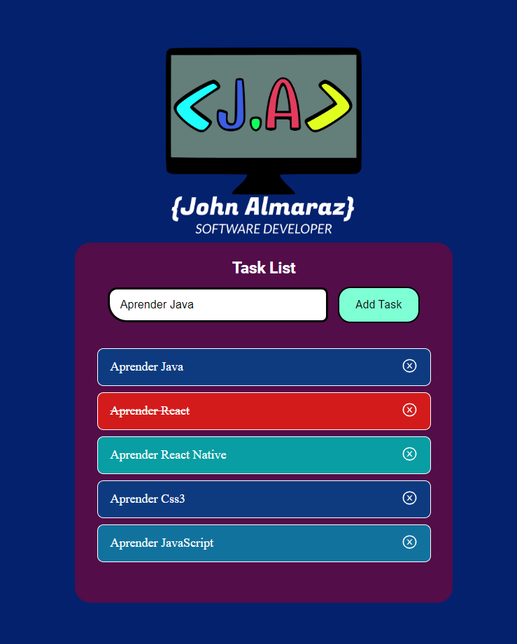

# Generador de tareas
Esta aplicacion tiene como finalidad agregar varias tareas.

Sus acciones son:
1. Agregar Tareas
2. Finalizar tarea (haciendo click sobre la tarea finalizada)
3. Eliminar tarea (Haciendo click sobre el icono de la 'x' de la tarea correspondiente)

